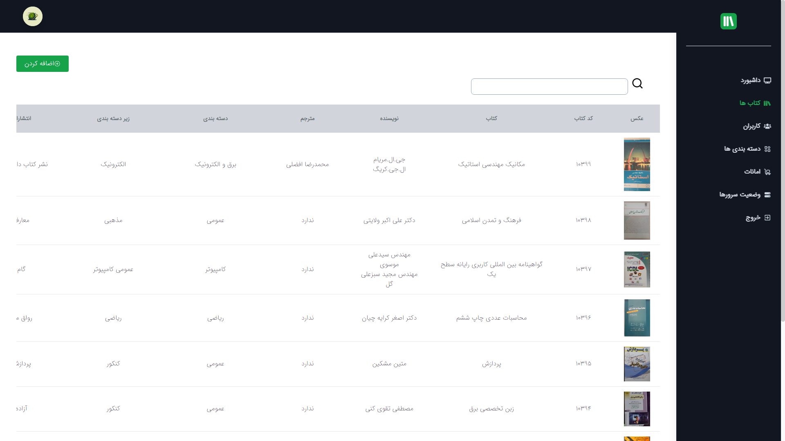
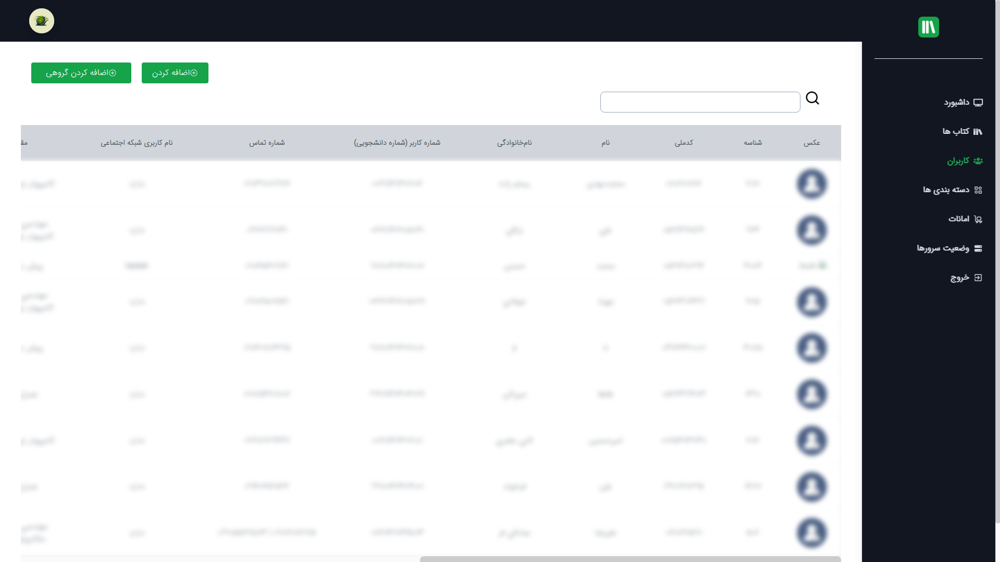
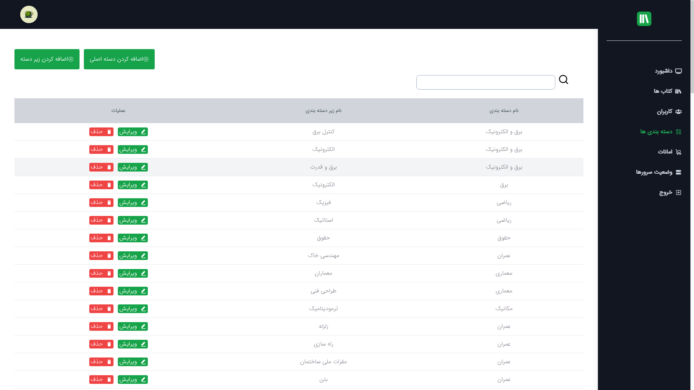
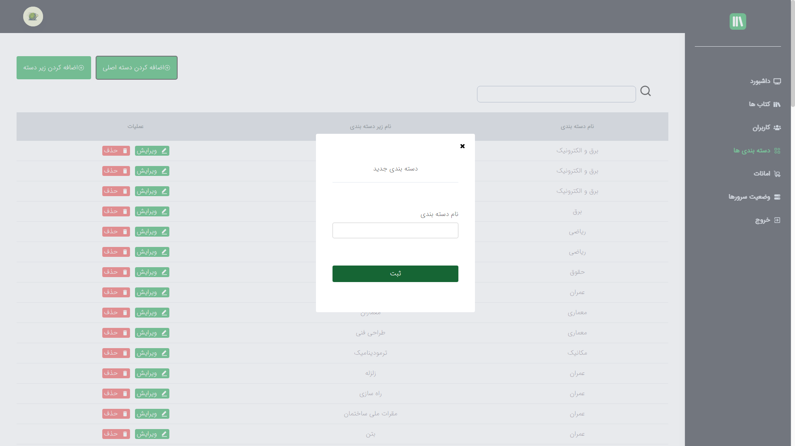
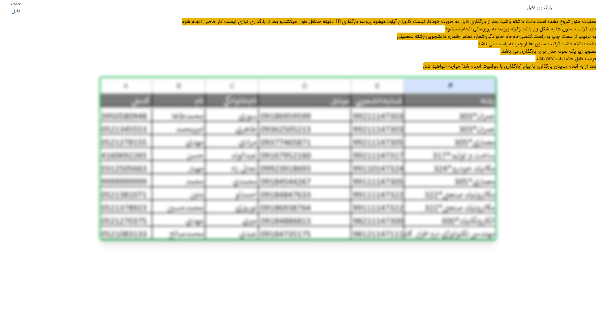
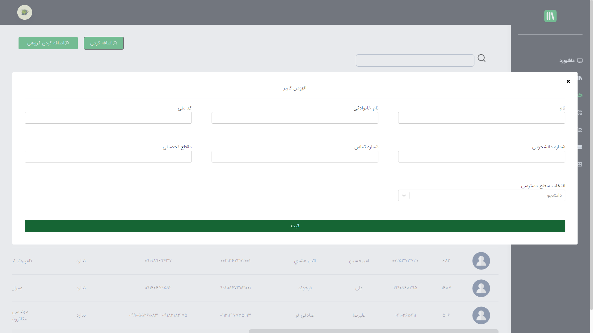
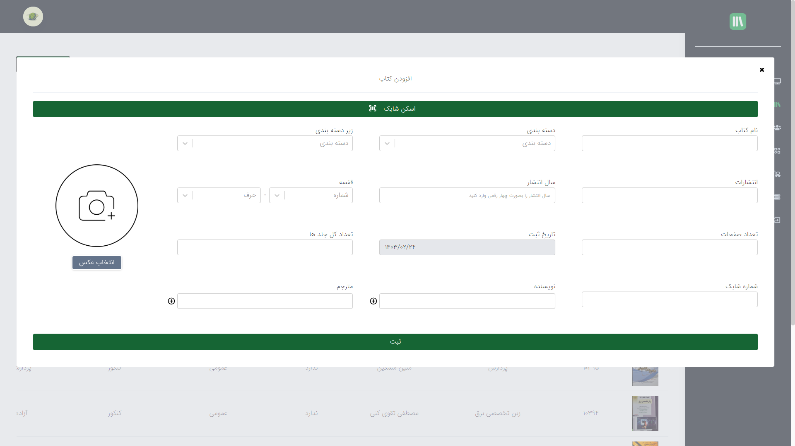
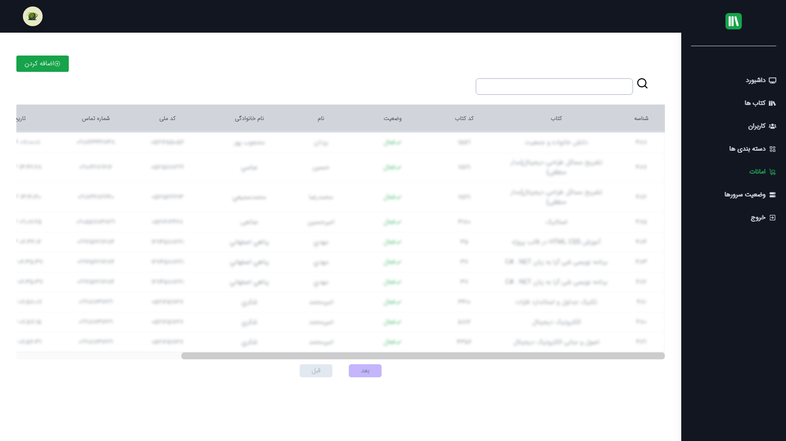
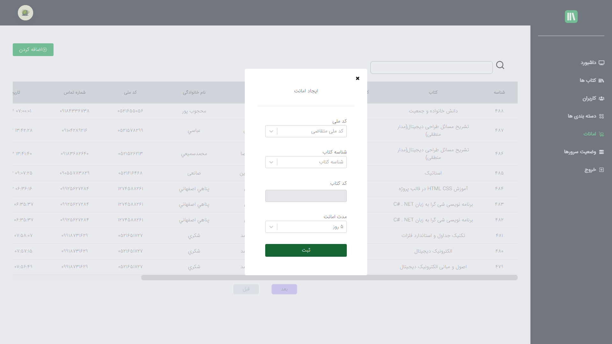
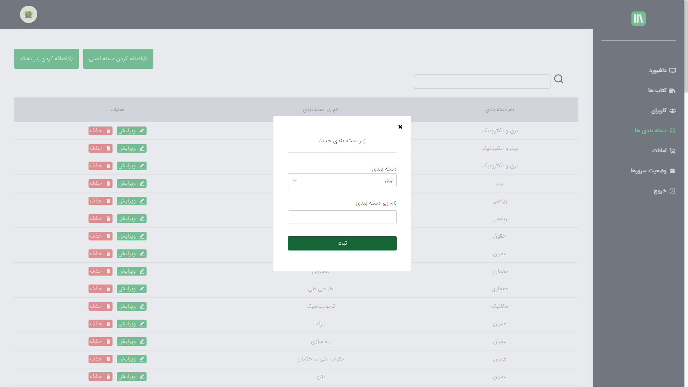

##  Description of the Boookito-Admin 
This project was created in 2021 and is open source. Using this source, you can create an online library management website. Currently, this service is available in the [boookito](https://boookito.ir) domain for Amirkabir Arak University.
You can localize this template for your region. Of course, this project requires backend source code and this source is for library management. Also, the user side source code can be accessed at this address. [boookito-client](https://github.com/Bettercode-co/boookito-client)


Send an email to buy the source code of the server side [email](mailto:m789219@gmail.com)

## <h4> DashboardPage </h4> 

## <h4> BooksPage </h4> 

## <h4> UsersPage </h4> 

## <h4> CategoriesPage </h4> 

## <h4> NewCategory </h4> 

## <h4> NewUsers </h4> 

## <h4> NewUser </h4> 

## <h4> NewBookPage </h4> 


## <h4> BorrowersPage </h4> 


## <h4> NewBorrowing </h4> 



## <h4> NewSubCategoryPage </h4> 


First, run the development server:

```bash
npm run dev
# or
yarn dev
```

Open [http://localhost:3000](http://localhost:3000) with your browser to see the result.

You can start editing the page by modifying `pages/index.js`. The page auto-updates as you edit the file.


The `pages/api` directory is mapped to `/api/*`. Files in this directory are treated as [API routes](https://nextjs.org/docs/api-routes/introduction) instead of React pages.

## Learn More

To learn more about Next.js, take a look at the following resources:

- [Next.js Documentation](https://nextjs.org/docs) - learn about Next.js features and API.
- [Learn Next.js](https://nextjs.org/learn) - an interactive Next.js tutorial.

You can check out [the Next.js GitHub repository](https://github.com/vercel/next.js/) - your feedback and contributions are welcome!

## Support

If you have a problem running the source or you need the backend version or the admin version, [email me](mailto:m789219@gmail.com)
